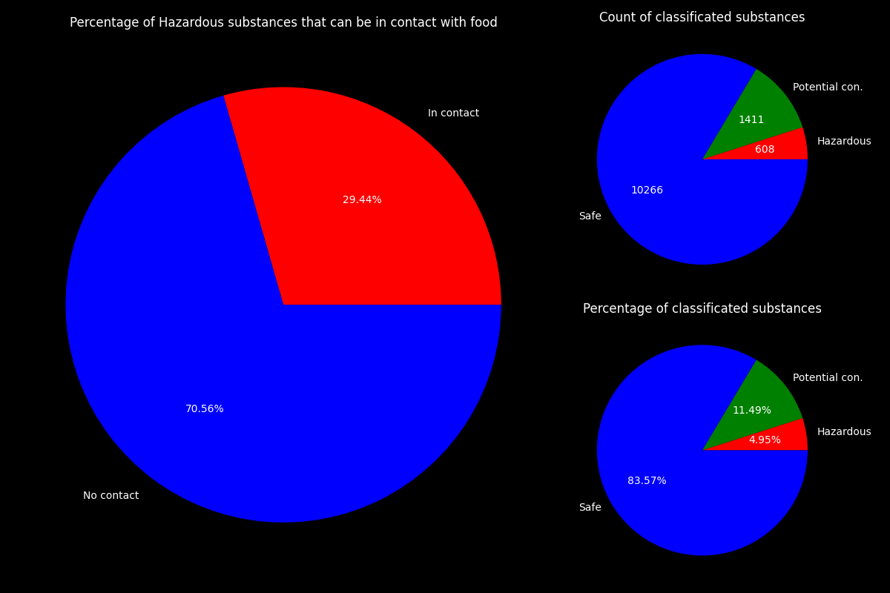

<style>
table {
  color: red;
}
</style>

# Analiza danych FFCdb

Wykonana przez: 
Jakuba Melzackiego i Bartosza Jakubowskiego

---

## 1. Środowisko programistyczne
* Zdecydowaliśmy się na użycie VisualStudioCode + domyślne wirtualne środowisko Python 3.11 (`venv`)
* Za pomocą środowiska testowego zainstalowaliśmy potrzebne nam paczki:
    - `requests` - Pobranie danych
    - `pandas` (w tym `numpy`) - Analiza i przygotowanie danych
    - `matplotlib`- Wizualizacja
    - Resztę paczek można znaleźć w pliku `requirements.txt`
    
---

### 1. Stawianie środowiska wirtualnego
* Postawienie środowiska wirtualnego:
    ```python -m venv venv```
* Uruchomienie środowsika:
    ```source venv/Scource/activate``` dla konsoli typu Bash
    ```./venv/Scripts/activate.bat``` dla konsoli typu PowerShell(Mogą być potrzebne uprawnienia administratora)
* Pobranie wymaganych bibliotek:
    ```pip install -r requirements.txt```
* Po pobraniu paczek można uruchamiać skrypt `start.py` z odpowiednimi flagami
---

### 1. Uruchamianie skryptu
* Po pobraniu paczek możemy uruchomić skrypt `start.py`:
    ```python skrypt.py```
    Pierwsze uruchomienie bez flag wygląda jakby nie zrobił nic, ale jeśli nie znalazł pobranego pliku źródłowego to go popbrał i wyczyścił.
* Uruchamianie z flagami:
    ```python skrypt.py -h```
    Wyświetli pomoc do pliku i jego wszystkie flagi do pomocy

---

## 2. Pobieranie danych

Do pobierania danych wykorzystaliśmy bibliotekę `requests` i wystawione API przez `zenodo`
```python
def download_xlsx(self) -> None:
        headers = {"Content-Type": "application/json"}
        resp = requests.get(API_XL_URL, headers=headers)

        if not resp.status_code == 200:
            return

        with open(FILE_NAME, "wb") as xl_file:
            xl_file.write(resp.content)
```

---

## 3. Praca z danymi

Punkt 3. składa się z 6 podpunktów przez, które przejdziemy na kolejnych slajdach

---

### 3.a Wczytanie FCCdb_FINAL_LIST do odpowiedniej struktury danych.

Do tego użyjemy biblioteki `pandas` i jej funkcji `read_excel`. 
Dla poprawnego czytania plików xlsx pobierzemy bibliotekę `openpyxl` i wykorzystamy ją do otworzenia naszych danych.  

```python
import pandas as pd

data = pd.read_excel(FILE_NAME, engine="openpyxl", sheet_name="FCCdb_FINAL_LIST")
```

---

### 3.b Przejrzenie co zawierają dane.

* Każdy wiersz ma reprezentować substancje i jej negatywne wpływy na człowieka i środowisko
* Dane zawierają m.in. informacje, jak:
    * Czy dana substancja jest wymieniona na liście sklasyfikowanych substancji przez różne organizacje?
    * Klasyfikacja czy dana substancja jest korzystana w typie materiału(Guma, Silikon, Związki nieorganiczne itp.)
    * Z danych można uzyskać informacje, które dane mają kontakt z jedzeniem

---

### 3.b Do czego mogą być wykorzystane dane

Dane można wykorzystać do:
* Zestawienia danych dla materiałów, np:
    - Ile substancji jest wykorzystywanych do danego materiału 
    - Ile związków jest szkodliwych wchodzących w skład materiału
* Zestwienia ile substancji sklasyfikowanych przez autoryzowane źródła jako szkodliwe ma kontakt z jedzeniem

---

### 3.c Wstępna analiza jakości danych.

Wiele kolumn w excelu wymaga czyszczenia. Ponieważ:
- Często jedna kolumna trzyma wiele różnych informacji
Każda wartość w kolumnie składa się z czeście przedzielonych `;`
a każda część trzyma inne dane
- Dane, które powinny być w postaci logicznej (True/False), takie nie są. Przykładowo dane, które mają informacje, czy substancja jest wymieniona w konkretnym źródle, ma wartość 0 lub [nazwa źródła], gdzie 0 oznacza, że substancja nie została wymieniona w źródle.

---

### 3.d Odrzucenie zbędnych kolumn wraz z uzasadnieniem.
- W danych znajdziemy parę kolumn, które są, albo w silnej korelacji, albo są duplikacją danych. Np.:
    1. Wartości kolumny `DK` (będę używać indeksów kolumn) są zmapowanymi wartościami `EB`, funkcją jeśli `EB` > 0 to `Defined Use` w innym wypadku `Undefined Use`
    ```
    Lp. DK              EB
    1   Defined Use     3
    2   Undefined Use   0
    3   Defined Use     1
    ...
    ```

---

### 3.e Przygotowanie danych do analizy szczegółowej – wedle uznania.

* Dane w kolumnach, które zawierają informację, które znoszą się do wartości logicznej True/False, są na taką zamieniane. Takie przekształcenie danych pozwoli na szczegółową analizę tych danych za pomocą metod statysycznych.

* Część danych z kolumn jest wyciągane jako nowe kolumny, np:
    - Maksymalny tonaż w ciągu roku zarejestrowany w Europie,
    - Czy ma kontakt z jedzeniem zarejestrowany przez CPPdb,
    - Czy ma kontakt z jedzeniem zarejestrowany przez organizację SIN

---

### 3.f Przygotowanie 2 wizualizacji, które opowiedzą jakąś historię.

- Przygotowaliśmy na cel tego podpunktu 4 wykresy. Które będą przedstawiać historię przykładów możliwego wykorzystania danych z punktu `3.b`. Tytuły wykresów przygotowaliśmy w języku angielskim, żeby pasowały do nazw materiałów.

---


---


---


---



---

### 3.f Wizualizacje

Wizualizacje:
1-3. Mają na celu przedstawić jak wiele substancji uznawanych za niebezpieczne przez źródła autoryzowane, można znaleźć w wielu materiałach.

4. Ma na celu przedstawić procent niebezpiecznych substacji, które mogą mieć kontakt z jedzeniem, oraz przedstawić ile tych niebezpiecznych związków jest.

---

### 4. Model ML

Postanowiliśmy postawić na Regresję Logistyczną w celu predykcji kolumny `Hazardous Auth` (czy związek jest uznany za toksyczny na bazie źródeł autoryzowanych) na bazie wszystkich innych kolumn logicznych.

---

### 4. Przygotowania

Skorzystaliśmy z biblioteki `scikit-learn`.

Pierwszy model jaki przeprowadziliśmy do nauki próbował się uczyć na wszystkich kolumnach, z wartościami logicznymi(True/False).

Teoretycznie predykcja na zbiorze testowym wyniosła ok. 94,6%.
Co może wróżyć dobre(Na prawde dobry model) lub złe wiadomości (Przewiduje praktycznie jedną wartość)

---


---


---

Wykresy powyżej pokazują, że to raczej były złe wieści. Nasz model wyuczył się, że praktycznie w większości czasu dane mają wartość `False`. Dlatego postanowił postawić tylko na tą opcje.

Wykres `ROC`, też pokazuje nam, że nasz model strzela gorzej niż, strzelanie odpowiedzi. 

Kto by pomyślał, że przesłanie wszystkich danych przez Model to zły pomysł? ;) Nie możliwe!

---

Dlatego postanowiliśmy spróbować innej kolumny

Tym razem padło na przewidzenie czy substancja ma kontakt z jedzeniem na bazie materiałów w jakich można ją znaleźć.

Teraz po uczeniu predykcja wyszła ok. 94,7%.

Sytuacja jak na razie jest podobna do poprzedniej, ale jak będą wyglądały następne wskaźniki.

---


---


---

Jeśli chodzi o `ROC` to Model wygląda w porządku.

Jeśli chodzi o "Macierz Pomyłek"(`Confusion Matrix`). Wynik jest lepszy niż poprzedni, ponieważ nasz model zaczął wybierać inne opcje niż Fałsz.

---

### 5. Podsumowanie ML

Po przeanalizowaniu danych, doszliśmy do wniosku, że otrzymane dane są bardzo ciężkie do przeprowadzania na nich modeli ML. 

Dla celów zadania zostawiamy w kodzie funkcjonalność do tworzenia modelu za pomocą Regresji Logistycznej do kolumny o kontakcie z jedzeniem.

---

# Dziękujemy za uwagę

Jakub Melzacki i Bartosz Jakubowski